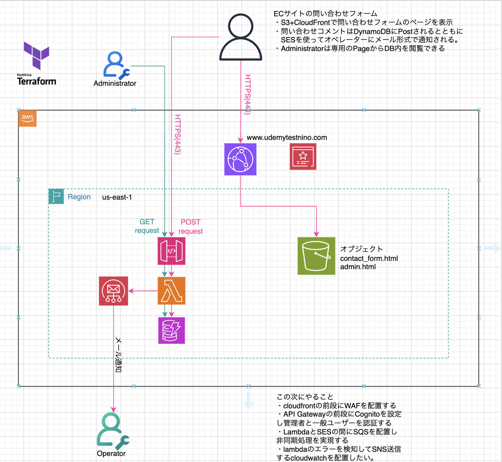

# portfolio

### HTML page 一般用 問い合わせ内容をDBに保存できる
https://nino0708.github.io/portfolio/HTMLfiles/contact_form

### HTML page 管理者用　DB内を閲覧可能
https://nino0708.github.io/portfolio/HTMLfiles/admin.html

### 構成図

<h1>(構成概要)</h1>
1.ユーザーがhtmlフォームに情報を入力 
2.htmlへはhttpsで接続 
3.htmlへのアクセスは独自ドメイン 
4.入力された情報はDBに保存 
5.DBに書き込まれた情報をオペレーターにメールで通知 
-----
-----
構図：

1.静的Web Pageの提供 
ユーザー→Route53→CloudFront(HTTPS)→S3(静的html)

2.問い合わせ内容の送信 
ユーザーがフォーム送信→API Gateway(REST API)(HTTPS)→Lamda→DynamoDB/SESでメール送信

-----
----- 
サービス選定：
・CloudFront+S3
選定理由：
-各サービス学習の為
-AWSインフラとして標準的
-AWSの基本サービスだけで完結
-キャッシュ制御
-OACでS3バケットを非公開にしたままCloudFront経由のみ公開できる
 
・ACM
-証明書発行・管理
-自前で準備する必要なし
-自動更新により有効期限の管理が不要である
 
・Route53
-独自ドメイン利用
-ACMの検証のため
　DNS検証とメール検証の２つ選べるが、ACMの自動更新をできるのがDNS検証のみとなっている。
 
・API Gateway REST API (選択肢：API Gateway HTTP API or API Gateway REST API or Lambda Function URL等)
選定理由：
-今後、認証や制御等拡張性があるため
 
・Lambda
-サーバレス
-自動スケール
 
・DynamoDB　(選択肢：DynamoDB or RDS or Aurora)
選定理由：
-単純な登録・参照に最適
-今回SQL等必要なし
-Lambdaとともにサーバーレスアーキテクチャで統一
 
・SES　(選択肢：SES or SNS)
選定理由：
-柔軟に本文や件名を作れる
