## 発表の流れ（15分）

| # | 内容 | 目安 |
|---|---|---|
| 1 | きっかけ — レンタルサーバー月1,500円の壁 | 2分 |
| 2 | 今回の要件 | 1分 |
| 3 | 構成 — 「使う時だけ生やして、消す」 | 2分 |
| 4 | 構築手順（実演の画面つき） | 5分 |
| 5 | いくらかかるのか / 損益分岐点は何時間か | 4分 |
| 6 | ハマったところ・まとめ | 1分 |

---

## 1. きっかけ

私はもともとITの世界を知らず、PCゲームもやってきませんでした。

ある日、友達とPCゲームをやったときのことです。**複数人で一緒に遊ぶには誰かのPCをサーバーにする必要がある**、でも個人PCではスペックが足りない —— だから友達は**レンタルサーバーを契約している**、という話を聞きました。

「ゲームをするために、別でサーバーを建てる」という発想自体が、その時初めて知る世界でした。

そこで料金を調べてみると、マイクラに最低限必要と言われる**メモリ4GB**のプランで、**月額1,000〜2,200円**が相場でした。

- Xserver GAMES 4GBプラン：365日契約で月換算 **約1,168円**
- 4GBプランの相場全体：**月950円〜2,200円**

（出典：[マイクラサーバーレンタル完全ガイド](https://www.quicca-plus.com/svnavi/2025-06-minecraft-server-rental-guide/) / [おすすめマイクラレンタルサーバー徹底比較 2026年8月版](https://fikaweb.jp/game/minecraft-rental-server/)）

遊ぶのは**週末に3時間だけ**。なのに、**残りの165時間分も払っている**。

ちょうどAWSを勉強していたので、こう思いました。

> **使う時だけ起動すれば、レンタルより安くできるのでは？**

これがこの調査のきっかけです。

---

## 2. 今回の要件

| 要件 | 内容 |
|---|---|
| メモリ | **4GB**（マイクラサーバーの実質最低ライン） |
| 遊ぶ頻度 | **毎週末3時間**（＝月に約13時間） |
| PC | 高スペックPCは持っていない、買うお金もない |
| ストレージ | PCの空き容量も少なく、サーバーを置く場所がない |
| 規模 | **小さく始めたい人向け**。いきなり月額契約を背負いたくない |

この「**PCに何も置かず、遊ぶ時間だけ課金される**」という条件が、そのままクラウドの得意分野でした。

---

## 3. 構成 — 「使う時だけ生やして、消す」

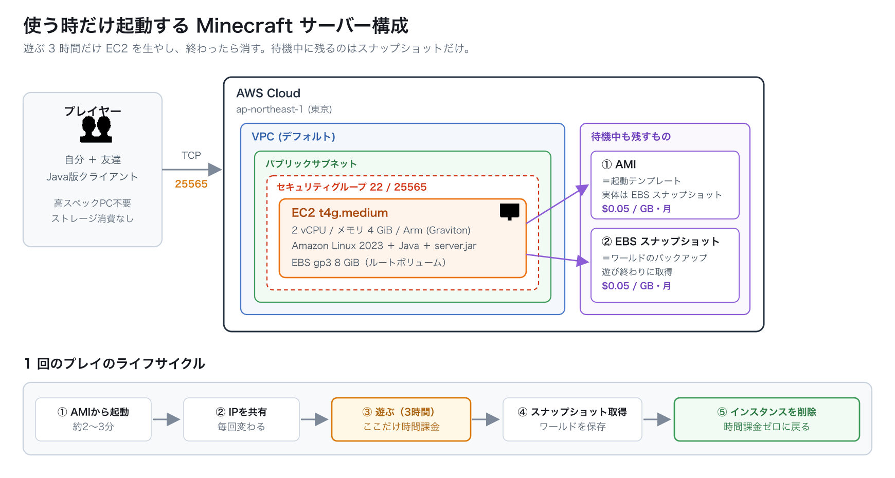

ポイントは1つだけです。

> **EC2インスタンスは"持ち物"ではなく"使い捨て"にする。**
> 待機中に残すのは **AMI** と **EBSスナップショット** の2つだけ。

### なぜこれで安くなるのか

EC2の料金は「起動している時間」に対して発生します。つまり、

- **インスタンスを削除してしまえば、時間課金は完全にゼロ**になる
- でも削除したらワールドも消える → だから **AMI（起動テンプレート）** と **スナップショット（ワールドのバックアップ）** だけ残しておく
- 遊ぶ時に AMI から起動し直せば、前回の続きから遊べる

残るのは**スナップショットの保管料だけ**。これが月100円ちょっとです。

### 「停止（stop）」ではダメなのか

ここが一番の勘所です。

| やり方 | 時間課金 | 待機中に残る課金対象 | 待機中の月額 |
|---|---|---|---|
| 起動しっぱなし | かかる | EC2 ＋ EBS ＋ IPv4 | 約 **¥5,830** |
| 停止（stop）するだけ | かからない | **EBSボリューム 8GiB** | 約 **¥122** |
| **AMI化して削除** | かからない | スナップショットのみ | **¥30〜127** |

**停止（stop）でも時間課金は止まります。** ただし**停止中もEBSボリュームの料金は発生し続けます**（gp3は東京で $0.096/GB・月）。8GiBなら月¥122です。

一方でAMI化して削除した場合、**スナップショットは「実際に使っているブロック」しか課金されません**（増分バックアップ）。8GiBのボリュームでも中身が3GB程度なら、課金対象も3GB程度です。

- 最悪ケース（8GB×2本をフルで課金）：**¥127**
- 現実的なケース（実使用3GB＋差分）：**¥30〜50**

つまり **AMI化して削除するほうが、実際には停止の半分以下**になります。加えて「うっかり起動しっぱなしにする」事故も物理的に起きなくなります。

この記事では**安全側に倒して、最悪ケースの ¥127 で計算します**（実際はもっと安くなります）。

### 設計上の割り切り：IPアドレスは固定しない

今回、**Elastic IP（固定IP）は使わないことにしました。**
接続するときは、毎回そのときのパブリックIPを入力してもらう運用です。

理由はシンプルで、**固定IPは「使っていない間」もお金を取られるから**です。

| | 稼働中（月13時間） | 待機中（月717時間） | 月額合計 |
|---|---|---|---|
| Elastic IPで固定する | ¥10 | **¥570** | **¥580** |
| **毎回IPを共有する** | ¥10 | **¥0** | **¥10** |

パブリックIPv4は $0.005/時ですが、**Elastic IPは「どこにも繋がっていない状態」でも同じ料金がかかります**。
一方インスタンスを削除してしまえば、そのIPは解放されるので**待機中は完全に0円**です。

月13時間しか遊ばないのに、固定IPのために月¥580払う —— これは**サーバー代（¥229）より固定IP代のほうが高い**という本末転倒な状態です。

**IPを毎回共有する手間 = 月¥570の節約。** ここは手間を取りました。

> Discordのグループチャットに毎回IPを貼るだけなので、実際の手間は10秒程度です。
> どうしても固定したくなったら、無料のDDNSやドメインを当てる手もあります（後述の「次にやりたいこと」参照）。

### 1回のプレイの流れ

1. AMIからインスタンスを起動（2〜3分）
2. 表示されたパブリックIPを友達に共有（**毎回変わります**）
3. 遊ぶ（3時間）— **ここだけ時間課金**
4. 遊び終わったらスナップショットを取得（ワールドを保存）
5. インスタンスを削除 → 時間課金ゼロに戻る

---

## 4. 構築手順

### 4-1. EC2インスタンスを作る

**インスタンスタイプ**は `t4g.medium`（2 vCPU / メモリ4GiB / Arm系Graviton）を選びます。

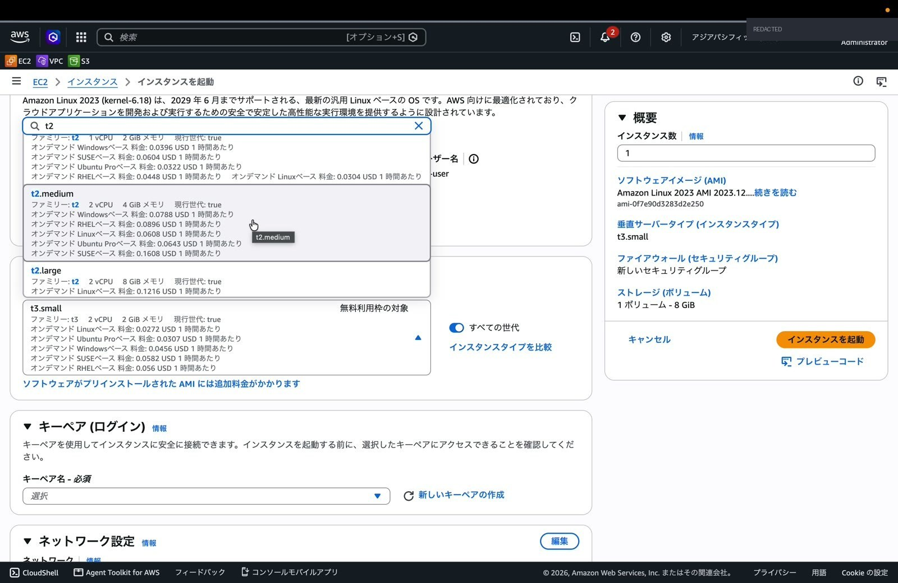

> **なぜ Arm（t4g）なのか**
> 同じ4GBメモリでも、Intel系の `t3.medium` は東京で $0.0544/時、Arm系の `t4g.medium` は **$0.0432/時**。**約2割安い**です。
> マイクラサーバー（Java版）はArmでも普通に動くので、ここは素直にArmを選びます。

**ネットワーク設定**はデフォルトVPCのパブリックサブネットでOKです。

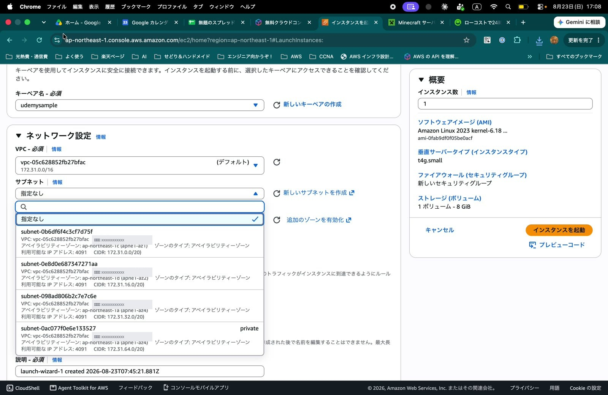

**セキュリティグループ**が今回いちばん大事な設定です。マイクラのJava版サーバーは **TCP 25565番ポート**を使います。ここを開けないと、サーバーが動いていても誰も繋がりません。

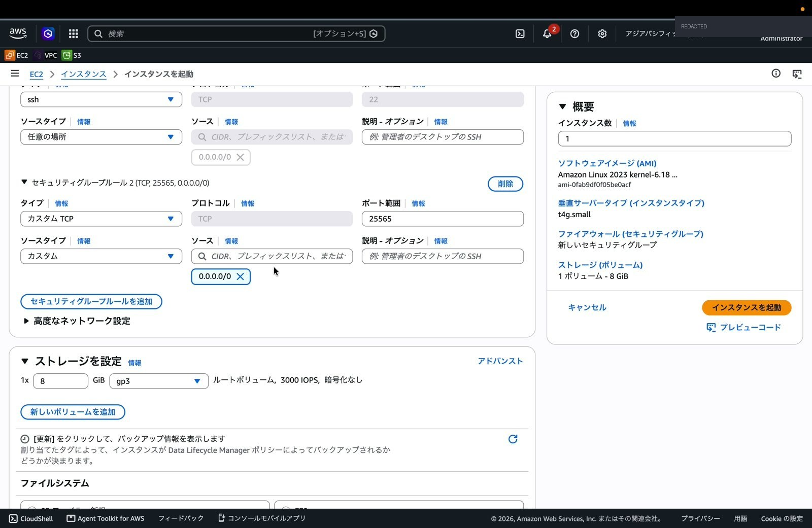

- `SSH (22)` — 自分が管理用に入るため
- `カスタムTCP (25565)` — マイクラのクライアントが繋ぐため

> ⚠️ 画面では手軽さ優先で `0.0.0.0/0`（どこからでも）にしていますが、**SSHの22番だけは自宅のIPに絞る**のを強くおすすめします。25565は友達が各自の回線から繋ぐので、実質全開放になります。

**ストレージ**はデフォルトの **8GiB gp3** のまま。ワールドデータはここに置きます。

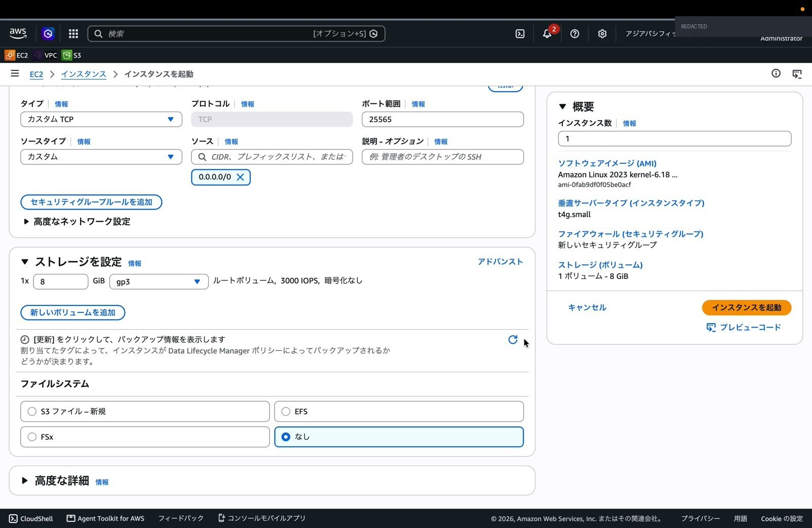

> 「ファイルシステム」の欄でS3やEFSを選べますが、**ここは「なし」でOK**です。
> マイクラのワールドデータ（`.mca`ファイル）は保存のたびに細かい部分書き込みが大量に走るので、S3マウント上に置くと動作が不安定になります。**素直にEBS（ルートボリューム）に置く**のが正解です。

### 4-2. サーバー本体をインストールする

インスタンスに **EC2 Instance Connect** で入ります（ブラウザだけで入れるので、鍵ファイルの管理が要りません）。

まず、Java版サーバーの配布ページから `server.jar` のURLを取ります。

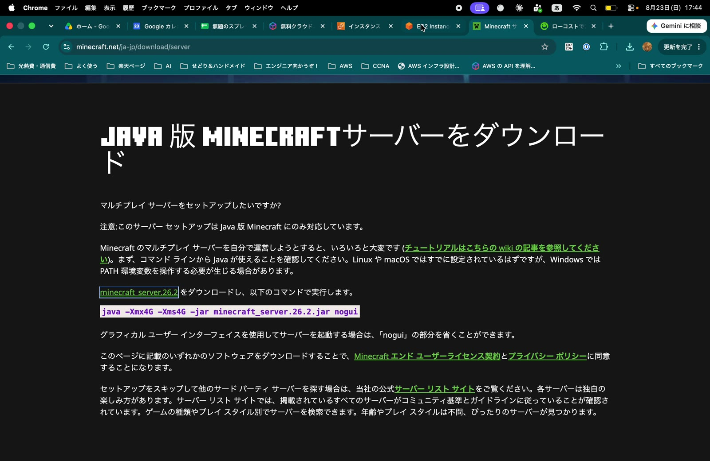

実際に打ったコマンドがこちらです。

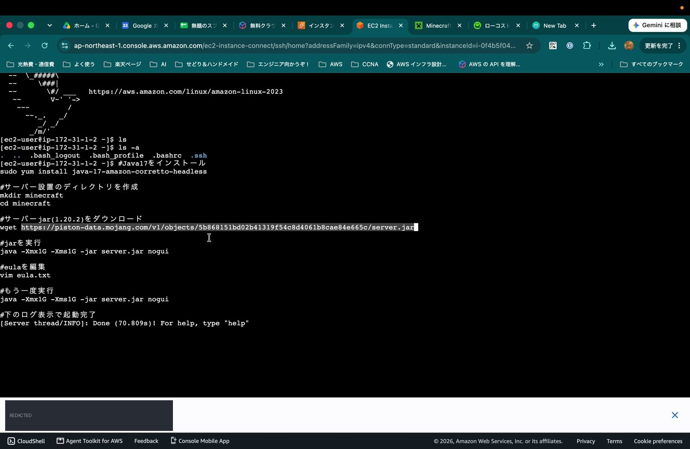

```bash
# 1. Java をインストール
sudo dnf install -y java-25-amazon-corretto-headless

# 2. サーバー設置用ディレクトリを作成
mkdir minecraft && cd minecraft

# 3. server.jar をダウンロード（URLは公式配布ページから取得）
wget https://piston-data.mojang.com/v1/objects/<ハッシュ>/server.jar

# 4. 初回実行（ここは必ず失敗します。eula.txt を生成させるのが目的）
java -Xmx3G -Xms3G -jar server.jar nogui

# 5. eula.txt を編集して同意する
vim eula.txt      # eula=false → eula=true

# 6. もう一度実行
java -Xmx3G -Xms3G -jar server.jar nogui
```

**`-Xmx3G` にしている理由**：公式ページには `-Xmx4G` と書いてありますが、これは**マシンのメモリが4GBちょうどの場合はやりすぎ**です。OS自身も数百MB使うので、JVMに4GB全部渡すとメモリ不足で落ちます。**4GBのマシンなら3GB程度**に抑えるのが安全です。

### 4-3. EULA（利用規約）に同意する

初回実行は必ずこのエラーで止まります。これは**仕様**で、`eula.txt` を生成させるための手順です。

```
[ServerMain/WARN]: Failed to load eula.txt
[ServerMain/INFO]: You need to agree to the EULA in order to run the server.
```

生成された `eula.txt` の `eula=false` を `eula=true` に書き換えます。

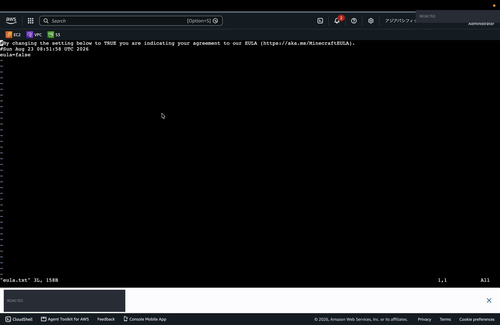

vimでの書き換え方（vimに慣れていない人向け）：

```
1. : を押す（コマンドモードに入る）
2. %s/eula=false/eula=true/g と入力して Enter
3. :wq と入力して Enter（保存して終了）
```

### 4-4. 起動成功

もう一度実行して、このログが出れば完成です。

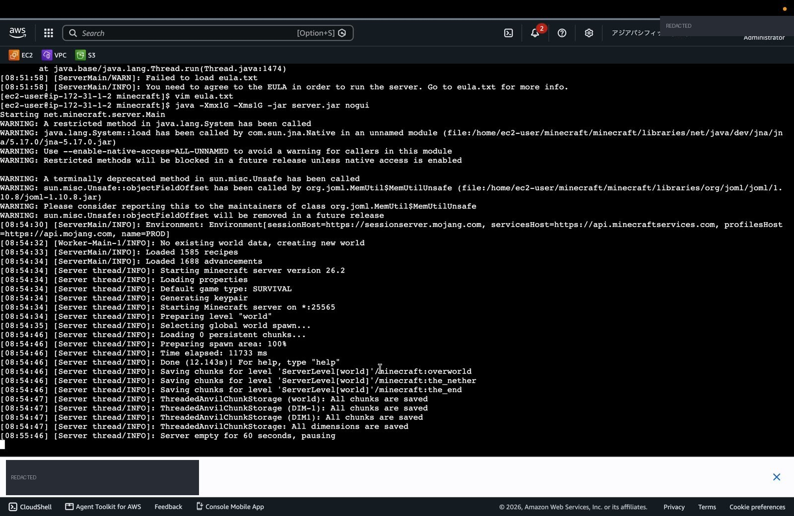

```
[Server thread/INFO]: Starting minecraft server version 26.2
[Server thread/INFO]: Starting Minecraft server on *:25565
[Server thread/INFO]: Done (12.143s)! For help, type "help"
```

`Done (○○s)!` が出たら起動完了です。

### 4-5. クライアントから繋ぐ

マイクラを起動 → **マルチプレイ** → **サーバーを追加** → サーバーアドレスに **EC2のパブリックIP** を入力します。

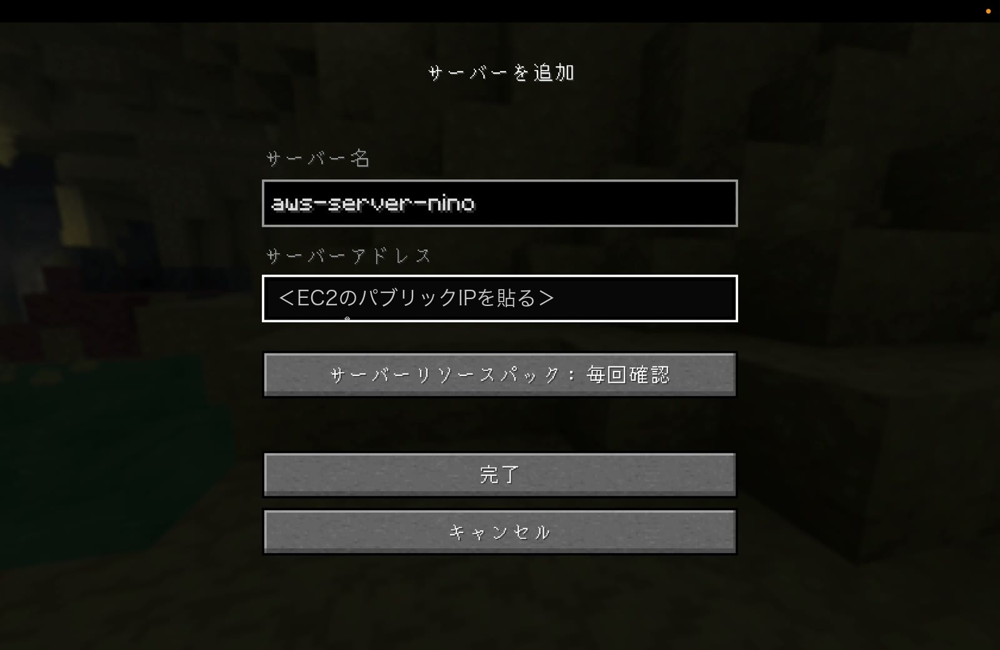

緑のアンテナが立てば接続成功です。

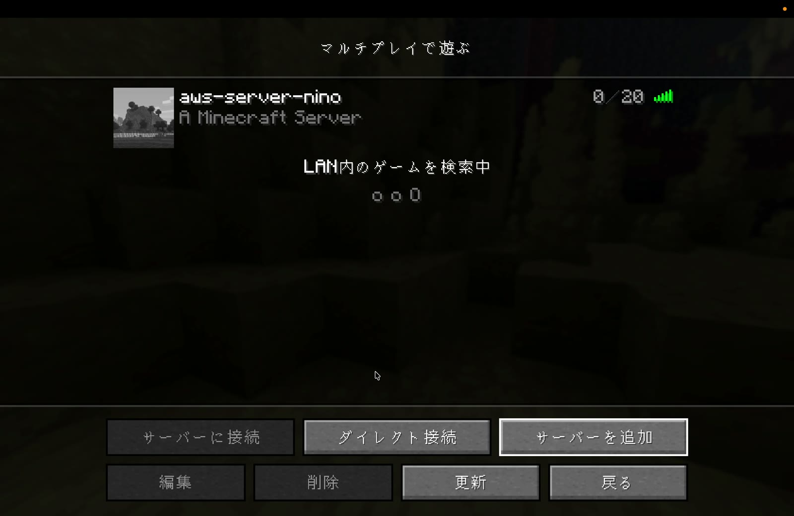

> ここで入力するIPは、**インスタンスを作り直すたびに変わります**。
> 前述のとおり今回は**固定IPを使わない設計**なので、遊ぶたびにこの欄を入れ直してもらう運用です。手間は10秒、その代わり月¥570浮きます。

---

## 5. いくらかかるのか

### 5-1. 料金の内訳（東京リージョン・実測値）

料金は「**稼働中だけかかるもの**」と「**待機中もかかり続けるもの**」に分けて考えます。

**■ 稼働中だけかかるもの（時間課金）**

| 項目 | 単価 | 1時間あたり |
|---|---|---|
| EC2 t4g.medium | $0.0432 / 時 | $0.0432 |
| EBS gp3 8GiB（ルートボリューム） | $0.096 / GB・月 | $0.00105 |
| パブリックIPv4アドレス | $0.005 / 時 | $0.005 |
| **合計** | | **$0.0493 / 時（約¥7.8）** |

**■ 待機中もかかり続けるもの（保管料）**

| 項目 | 単価 | 月額 |
|---|---|---|
| AMIのスナップショット（8GB想定） | $0.05 / GB・月 | $0.40 |
| EBSスナップショット（8GB想定） | $0.05 / GB・月 | $0.40 |
| **合計** | | **$0.80 / 月（約¥127）** |

> **これでも多めに見積もっています。** 前述のとおりEBSスナップショットは増分課金なので、実際には**月30〜50円程度**に収まる可能性が高いです。安全側に倒して¥127で計算を進めます。

つまり月額はこの式になります。

> **月額（円） = 127 + 7.8 × 稼働時間**

**データ転送料**：AWSからインターネットへの送信は**月100GBまで無料**です。数人で数時間遊ぶ程度なら余裕で収まるので、今回は0円として扱います。

### 5-2. 損益分岐点は何時間か

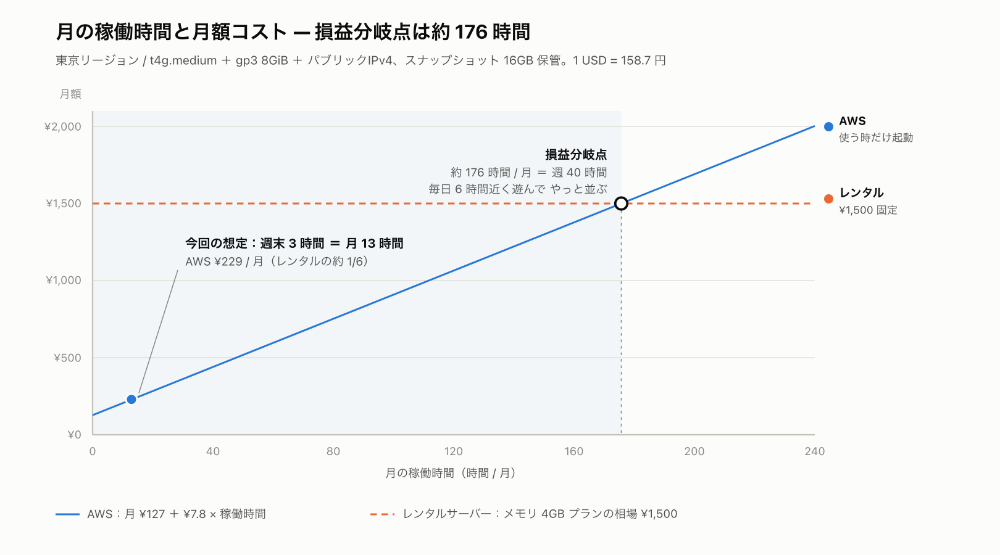

レンタルサーバーを**月1,500円**とすると、

```
127 + 7.8 × H = 1500
H = 176 時間 / 月
```

**約176時間 / 月**、つまり**週40時間**、**毎日6時間近く**遊んで、ようやくレンタルサーバーと並びます。

レンタル料金別に見るとこうなります。

| レンタル月額 | 損益分岐点 | 週あたり |
|---|---|---|
| ¥1,000 | 112時間 / 月 | 週26時間 |
| **¥1,500** | **176時間 / 月** | **週40時間** |
| ¥2,200 | 265時間 / 月 | 週61時間 |

### 5-3. 今回の想定だといくらか

| 稼働時間 | AWS月額 | レンタル(¥1,500) | 差 |
|---|---|---|---|
| **13時間（週末3時間）** | **¥229** | ¥1,500 | **¥1,271 安い** |
| 30時間 | ¥361 | ¥1,500 | ¥1,139 安い |
| 60時間 | ¥596 | ¥1,500 | ¥904 安い |
| 120時間 | ¥1,065 | ¥1,500 | ¥435 安い |
| 176時間 | ¥1,500 | ¥1,500 | **±0（分岐点）** |
| 730時間（24時間つけっぱなし） | ¥5,833 | ¥1,500 | **¥4,333 高い** |

**週末3時間なら月229円。レンタルサーバーの約6分の1です。**
年間にすると **¥2,748 vs ¥18,000** で、**約1万5千円の差**になります。

### 5-4. 逆に、AWSが負けるのはどこか

正直に書いておきます。**24時間つけっぱなしにするなら、レンタルサーバーの圧勝です**（¥5,833 vs ¥1,500）。

この構成が勝てるのは、**「遊ぶ時間が短く、かつ毎回ちゃんと消す運用ができる」場合だけ**です。
消し忘れて1ヶ月放置すると、レンタルより4,000円高くなります。ここが唯一にして最大のリスクです。

---

## 6. ハマったところ

### Javaのバージョンが古くて起動しない

一番時間を溶かしたのがこれです。

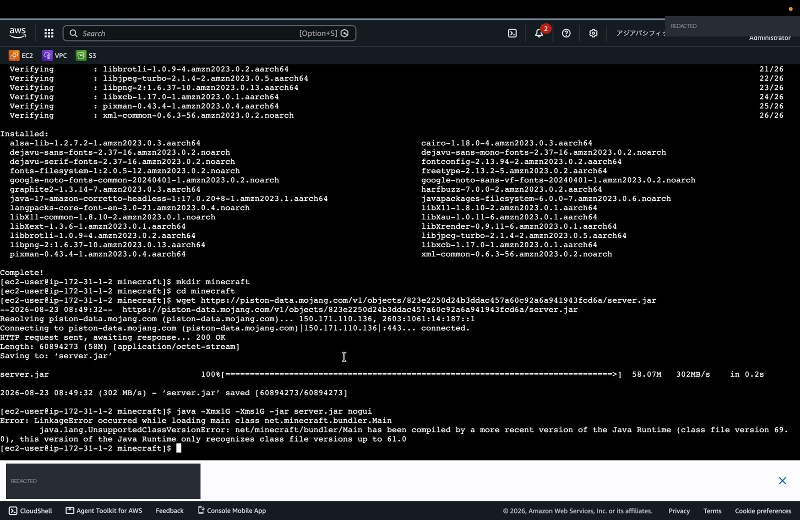

```
Error: LinkageError occurred while loading main class net.minecraft.bundler.Main
  java.lang.UnsupportedClassVersionError: net/minecraft/bundler/Main has been compiled
  by a more recent version of the Java Runtime (class file version 69.0),
  this version of the Java Runtime only recognizes class file versions up to 61.0
```

**エラーの読み方**：

- `class file version 61.0` = インストール済みのJava = **Java 17**
- `class file version 69.0` = server.jarが要求するJava = **Java 25**

ネット上の記事の多くが「Java 17を入れろ」と書いていますが、**最新のserver.jarはJava 25を要求します**。記事の情報が書かれた時点のバージョンに引きずられた形です。

**直し方**（Java 17をアンインストールする必要はありません。追加で入れるだけ）：

```bash
sudo dnf install -y java-25-amazon-corretto-headless

# 複数バージョンが入るので、使うJavaを明示的に切り替える
sudo alternatives --config java
```

> **教訓**：`class file version` の数字とJavaのバージョンは対応表が決まっています（`61`=Java17、`65`=Java21、`69`=Java25）。この数字を読めば、記事を探し回らなくても必要なバージョンが即わかります。

### 初回実行は「失敗して正解」

`Failed to load eula.txt` は**エラーではなく手順の一部**です。ここで慌てて調べ直すと時間を無駄にします。

---

## まとめ

- **「使う時だけ起動して、終わったら消す」** —— これだけでレンタルサーバーの**約6分の1**になった
- 待機中に残すのは **AMI** と **EBSスナップショット** だけ。月**約127円**
- 損益分岐点は **月176時間（週40時間）**。週末3時間なら圧倒的にAWSが安い
- 逆に**つけっぱなしにするなら負ける**。この構成は「消す運用」とセットで初めて成立する
- PCのスペックも空き容量も一切要らない。**サーバーを持たずにサーバーを持てる**のがクラウドの面白さだった

IT未経験からAWSを勉強し始めて、「知識が実際に自分の財布に効く」体験ができたのが一番の収穫でした。

---

## 次にやりたいこと

- **起動/停止の自動化** — LambdaとEventBridgeで「遊ぶ時間になったら起動、誰もいなくなったら自動でスナップショット取って削除」まで自動化する。消し忘れリスクをここで潰せる
- **IaC化** — CloudFormationでテンプレート化して、誰でも同じ構成を再現できるようにする
- **Discord連携** — Discordのコマンドからサーバーを起動し、**起動時にその回のIPをチャットへ自動投稿**する。IPを手で共有する唯一の手間もこれで消える
- **IPを固定せずに名前で繋ぐ** — Route 53 や無料DDNSを使い、起動時にAレコードを今回のIPへ書き換える。固定IP代を払わずに「いつも同じアドレスで接続」が実現できる

---

## 補足：この記事の数字について

- 料金はすべて **AWS Pricing API から取得した東京リージョン（ap-northeast-1）の実額**です（2026年8月時点）
- 為替は **1 USD = 158.7円**（2026-08-21）で換算しています
- **注意**：ネットでよく見る `t4g.medium = $0.0336/時` は**バージニア北部リージョンの価格**です。東京は **$0.0432/時**で、約28%高くなります。マイクラは遅延が体感に直結するので、**東京リージョンを選ぶ前提**で計算しました
- 実演の録画では検証用に `t4g.small`（メモリ2GB）で構築しています。要件どおりのメモリ4GBは `t4g.medium` で、手順は同一です（JVMのヒープ指定だけ `-Xmx3G` に変わります）
